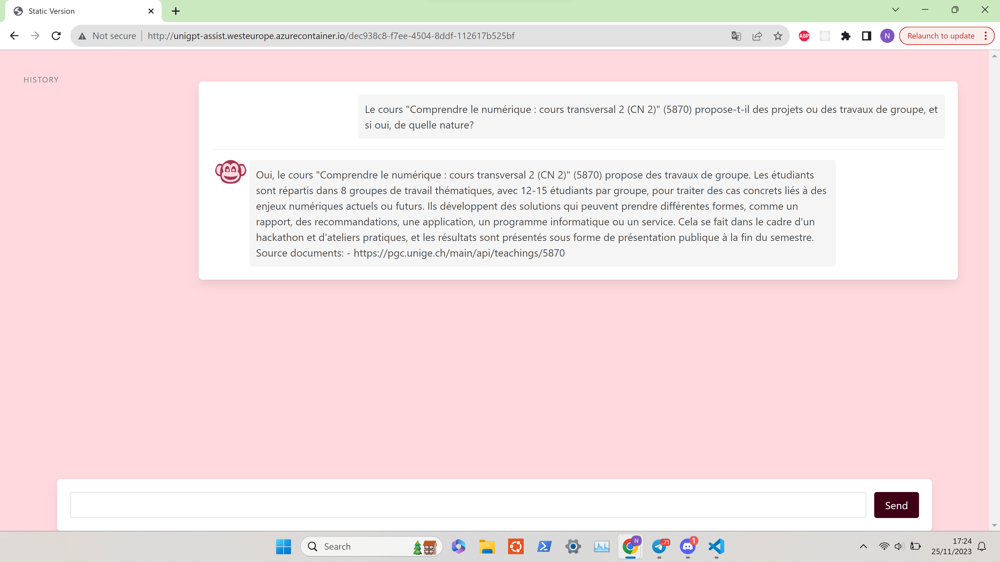

# UniGPT-Assist

This project was assembled during the Hackademia 2023 hackathon at the University of Geneva. The project has two interfaces: a website and a Discord-bot. The backend is based on the GPT-4 model augmented with a knowledge base.

## Technologies used

The website is implemented using HTML, CSS and JavaScript. Discord-bot is developed on Node.js. The backend and dynamic part of the website are implemented on Django Python framework. For retrieval-augmented generation (RAG) the LangChain framework with OpenAI and Pinecone vector database APIs is used. Deployment to Azure Container Instances is done using Terraform, Docker and the GitLab CI/CD pipeline.

## Demo

  
  

## Architecture

